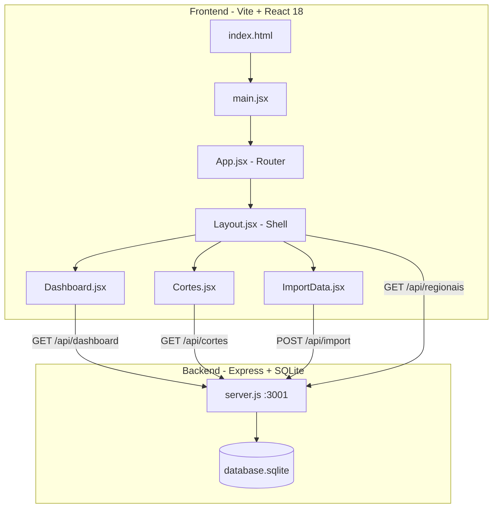

# DCMetas — Análise Completa do Sistema

## Visão Geral

Dashboard analítico da **Diretoria Comercial** (CAEMA), construído para acompanhar indicadores de arrecadação, metas e cortes de serviço. Alimentado por planilhas CSV importadas pelo usuário.

---

## Arquitetura

---

## Stack Tecnológica

| Camada | Tecnologia |
|---|---|
| **Frontend** | React 18 + Vite 5 + React Router 6 |
| **Estilização** | TailwindCSS v4 beta + CSS Variables (tema claro/escuro) |
| **Gráficos** | Recharts (AreaChart, BarChart) |
| **Ícones** | Lucide React |
| **Backend** | Express 5 (Node.js) |
| **Banco de Dados** | SQLite via `better-sqlite3` (WAL mode) |
| **Parsing CSV** | PapaParse (chunked, client-side) |
| **Fontes** | Inter + Plus Jakarta Sans (Google Fonts) |

---

## Banco de Dados — 5 Tabelas

| Tabela | Chave | Descrição |
|---|---|---|
| `localidades` | `id` (INT) | Dimensão: superintendência, regional, município, IBGE |
| `arrecadacao` | `id` (TEXT) | Fato: pagamentos diários com valor, categoria, banco, perfil |
| `metas_regional` | `id` (TEXT) | Meta por regional + categoria + mês |
| `metas_localidade` | `id` (TEXT) | Meta por localidade + mês |
| `cortes` | `id` (AUTOINCREMENT) | Ordens de corte: matrícula, situação, valores, datas |

### Índices
- `idx_arrec_mes`, `idx_arrec_loc` — Performance nas queries de arrecadação
- `idx_metas_ref`, `idx_metas_loc_ref` — Filtros de referência
- `idx_cortes_mes`, `idx_cortes_loc` — Performance nas queries de cortes

---

## API Endpoints (porta 3001)

| Método | Rota | Descrição |
|---|---|---|
| GET | `/api/stats` | Contagem de registros de todas as 5 tabelas |
| POST | `/api/import` | Importação em batch (5000 por lote). Tipos: `localidade`, `arrecadacao`, `meta_regional`, `meta_localidade`, `cortes` |
| POST | `/api/clear` | Limpa todas as tabelas |
| GET | `/api/regionais` | Lista distinct de regionais para o filtro |
| GET | `/api/dashboard?referencia=MM/YYYY&regional=X` | Dados consolidados para o painel de arrecadação |
| GET | `/api/cortes?referencia=MM/YYYY&regional=X` | Dados consolidados para o painel de cortes |

---

## Planilhas CSV (pasta `/csv`)

| Arquivo | Tabela destino | Tamanho |
|---|---|---|
| `dLocalidade.csv` | localidades | ~20 KB |
| `fArrecadacao.csv` | arrecadacao | ~20 MB |
| `fMetaArrecRegional.csv` | metas_regional | ~93 KB |
| `fMetaArrecLocalidade.csv` | metas_localidade | ~166 KB |
| `fcorte.csv` | cortes | ~17 MB |

### Colunas do `fcorte.csv`
`matricula`, `Categoria Principal`, `Localidade`, `Situacao da agua`, `data emissao`, `tipo documento`, `forma emissao`, `acao cobranca`, `valor documento`, `situacao acao`, `data acao`, `situacao debito`, `motivo encerramento`

---

## Páginas e Rotas

### `/` — Dashboard de Arrecadação ✅ COMPLETO
- **5 KPI Cards** com GaugeChart: Total, Residencial, Comercial, Industrial, Público
  - Cada um mostra Realizado vs Meta (Previsto) e a % de atingimento
- **Performance Anual** (AreaChart): Realizado vs Meta mês a mês
- **Entradas Diárias** (BarChart): Arrecadação por dia do mês
- **Ranking Regional** (BarChart horizontal): % de atingimento por regional
- **Tabela "Detalhamento por Município"**: Matriz Município x Meses com totais

### `/cortes` — Dashboard de Cortes ✅ COMPLETO
- **4 KPI Cards**: % Corte, % Recebido Antes, % Recebido Pós Corte, % Recebido Total
- **Evolução Diária** (AreaChart): Emitido vs Executado por dia
- **Tabela "Resumo por Regional"**: Emitido, Cortado, % Corte, Valor Cobrado, Valor Pago, % Recebido

### `/importar` — Base de Dados ✅ COMPLETO
- 5 cards de upload (Localidades, Arrecadação, Metas Regional, Metas Local, Cortes)
- Upload em batch com barra de progresso
- Botão "Limpar Tudo" com modal de confirmação
- Contagem de registros em tempo real

### `/hidrometracao` — Hidrometração ❌ NÃO DESENVOLVIDO (menu visual)
### `/os` — Ordens de Serviço ❌ NÃO DESENVOLVIDO (menu visual com submenu Pendentes/Encerradas)

---

## Componentes

| Componente | Função |
|---|---|
| [Layout.jsx](file:///d:/dcmetas/src/components/Layout.jsx) | Shell: Sidebar + Header + Outlet. Gerencia tema, referência (mês/ano) e regional. Submenu retrátil em OS |
| [KpiCard.jsx](file:///d:/dcmetas/src/components/KpiCard.jsx) | Card com GaugeChart + valores. Suporta `isCurrency` prop |
| [GaugeChart.jsx](file:///d:/dcmetas/src/components/GaugeChart.jsx) | SVG semicircular animado com % |
| [AnnualPerformance.jsx](file:///d:/dcmetas/src/components/AnnualPerformance.jsx) | Gráfico de área Realizado vs Meta anual |
| [DailyPerformance.jsx](file:///d:/dcmetas/src/components/DailyPerformance.jsx) | Barras diárias de arrecadação |
| [RegionalRanking.jsx](file:///d:/dcmetas/src/components/RegionalRanking.jsx) | Barras horizontais rankeadas por % |
| [DetailTable.jsx](file:///d:/dcmetas/src/components/DetailTable.jsx) | Tabela matrix com sticky column e totais |
| [MonthYearSelector.jsx](file:///d:/dcmetas/src/components/MonthYearSelector.jsx) | Seletores nativos de mês e ano |
| [RegionalSelector.jsx](file:///d:/dcmetas/src/components/RegionalSelector.jsx) | Dropdown customizado com fetch dinâmico |
| [ErrorBoundary.jsx](file:///d:/dcmetas/src/components/ErrorBoundary.jsx) | Captura erros de render e exibe fallback |

---

## Hooks

| Hook | Função |
|---|---|
| [useDashboardData.js](file:///d:/dcmetas/src/hooks/useDashboardData.js) | Fetch + processamento completo dos dados de arrecadação (KPIs, diário, anual, ranking, tabela) |
| [useCortesData.js](file:///d:/dcmetas/src/hooks/useCortesData.js) | Fetch dos dados de cortes via `/api/cortes` |

---

## Design System

### Tema (CSS Variables)
- **Claro**: `--bg-main: #f8fafc`, `--bg-surface: #ffffff`, `--text-main: #0f172a`
- **Escuro**: `--bg-main: #020617`, `--bg-surface: #0f172a`, `--text-main: #f8fafc`
- **Brand**: Paleta azul celeste (`#0ea5e9` como cor principal)

### Classes utilitárias customizadas
- `.glass-panel` — Glassmorphism (blur + transparência)
- `.heading-text` — Font Plus Jakarta Sans
- `.card-hover` — Animação hover com elevação

---

## Fórmulas de Negócio (Cortes)

| Métrica | Fórmula |
|---|---|
| % Corte | `(Total Executado / Total Emissão Ordem Corte) × 100` |
| % Recebido Antes | `(Valor Pago onde situação_ação ≠ EXECUTADA / Valor Cobrado) × 100` |
| % Recebido Pós Corte | `(Valor Pago onde situação_ação = EXECUTADA / Valor Cobrado Cortado) × 100` |
| % Recebido Total | `(Valor Pago Total / Valor Cobrado Total) × 100` |

---

## Status do Menu Lateral

| Item | Rota | Status | Submenu |
|---|---|---|---|
| 💵 ARRECADAÇÃO | `/` | ✅ Funcional | — |
| 💧 HIDROMETRAÇÃO | `/hidrometracao` | ❌ Visual only | — |
| ✅ ORDENS DE SERVIÇOS | `/os` | ❌ Visual only | Pendentes, Encerradas |
| ✂️ CORTES | `/cortes` | ✅ Funcional | — |
| 🗄️ Base de Dados | `/importar` | ✅ Funcional | — |
